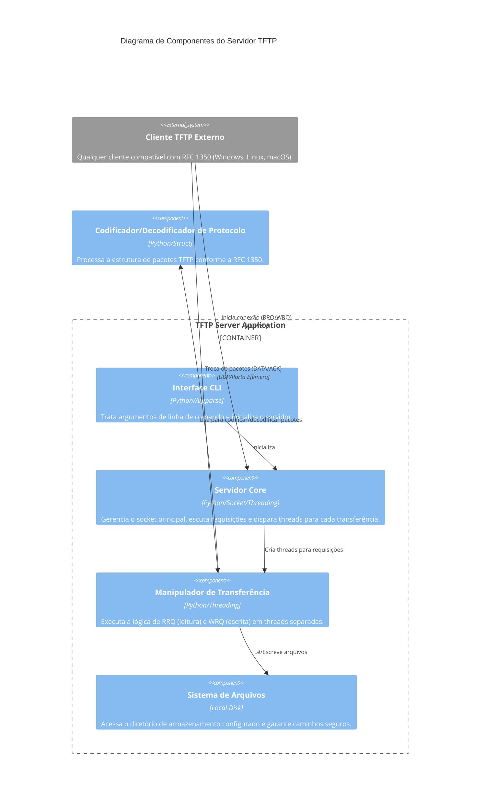

# TFTP Python Server

Implementação acadêmica de um servidor TFTP em Python, com interface de linha de comando, organização em pull requests, diagrama de componentes C4 e suporte a múltiplas conexões simultâneas.

## Descrição da atividade

Esta atividade tem como objetivo estudar o protocolo TFTP (Trivial File Transfer Protocol), compreender o fluxo de trabalho com pull requests em Git, modelar a arquitetura do sistema por meio de diagramas C4 e implementar, em Python, um servidor TFTP funcional.

O projeto foi desenvolvido considerando:
- Estudo do protocolo TFTP a partir da RFC 1350;
- Adoção de boas práticas de codificação com PEP 8;
- Uso de branches e pull requests para colaboração;
- Testes com clientes TFTP externos em diferentes sistemas operacionais.

## Equipe

| Membro | Matrícula |
|--------|--------|
| João Lucas Noronha de Castro | 2315310009 |
| Juliana Ballin Lima | 2315310011 |
| Leonardo Castro da Silva | 2215310016 |
| Leonardo Melo Crispim | 2315310036 |
| Lucas Carvalho dos Santos | 2315310012 |
| Renato Barbosa de Carvalho | 2315310021 |
| Vinicius Souza Costa | 2315310024 |

## Uso de IA no Desenvolvimento

Este projeto utilizou IA para auxiliar na revisão de código, sugestões de boas práticas, formatação de documentação e estruturação de diagramas. Todo código gerado ou sugerido foi revisado e testado pela equipe antes de ser integrado ao projeto.

## Estrutura do Projeto

```
tftp-server/
├── server.py                 # Servidor TFTP (RRQ/WRQ) e CLI
├── tftp_packets.py           # Codificação/decodificação de pacotes (RFC 1350)
├── .gitignore                # Arquivos ignorados pelo Git
└── README.md                 # Documentação principal
```

## Visão geral do protocolo TFTP

O TFTP é um protocolo simples de transferência de arquivos baseado em UDP. Ele foi projetado para cenários leves, como bootstrap de dispositivos e transferência de arquivos em redes locais.

### Características principais:
- Usa UDP como protocolo de transporte;
- Porta inicial 69 para escuta de requisições;
- Suporta leitura (RRQ) e escrita (WRQ);
- Transmite dados em blocos de 512 bytes;
- Usa confirmações (ACK) para cada bloco de dados;
- Gerenciamento de erros através de pacotes ERROR.

## Diagrama C4 - Nível de Componentes



## Componentes do sistema

### 1. Interface CLI
Responsável por processar os parâmetros de entrada, como host, porta, diretório base, timeout e modo de operação (ex: read-only).

### 2. Servidor Core
Gerencia o socket UDP principal. Quando uma requisição válida (RRQ ou WRQ) chega, ele cria uma nova thread dedicada para processar aquela transferência específica, permitindo que o servidor atenda múltiplos clientes simultaneamente.

### 3. Manipulador de Transferência
Implementa a lógica de transferência de estado:
- Para RRQ: Envia pacotes DATA e aguarda ACKs.
- Para WRQ: Envia ACK 0 e aguarda pacotes DATA.
Gerencia retransmissões em caso de timeout e encerramento de conexão.

### 4. Codificador/Decodificador de Protocolo
Localizado em `tftp_packets.py`, abstrai a complexidade da manipulação de bytes e structs para montagem dos pacotes RRQ, WRQ, DATA, ACK e ERROR seguindo rigorosamente a RFC 1350.

### 5. Sistema de Arquivos
Gerencia o acesso ao disco, garantindo que os arquivos sejam lidos ou gravados apenas dentro do diretório permitido (prevenção de Path Traversal).

## Requisitos

- Python 3.10+
- Sistema operacional Windows, Linux ou macOS

## Como executar

### Iniciar o Servidor
```bash
python server.py --host 0.0.0.0 --port 6969 --directory storage
```

Parâmetros disponíveis:
- `--host`: Endereço IP para bind (padrão: 0.0.0.0).
- `--port`: Porta UDP (padrão: 69).
- `--directory`: Diretório base para arquivos (padrão: storage).
- `--timeout`: Tempo de espera por pacotes em segundos (padrão: 3.0).
- `--retries`: Número de tentativas em caso de timeout (padrão: 3).
- `--read-only`: Desabilita comandos de escrita (WRQ).
- `--verbose`: Ativa logs detalhados de depuração.

## Como Testar

### 1. Preparação
Crie o diretório de armazenamento (o servidor cria automaticamente se não existir):
```bash
mkdir storage
```

### 2. Testar com Cliente TFTP do Windows
Certifique-se de que o "Cliente TFTP" está ativado nos "Recursos do Windows".

Download (GET):
```powershell
tftp -i 127.0.0.1 GET arquivo_no_servidor.txt
```

Upload (PUT):
```powershell
tftp -i 127.0.0.1 PUT arquivo_local.txt
```

### 3. Testar com Cliente TFTP no Linux
```bash
tftp 127.0.0.1 69
tftp> get arquivo.txt
tftp> quit
```

## Organização com pull requests

Utilizamos o padrão Conventional Commits para nomeação de branches e mensagens de commit:

| Prefixo | Descrição |
|---------|-----------|
| feat/ | Nova funcionalidade |
| fix/ | Correção de bug |
| docs/ | Documentação |
| test/ | Testes |
| refactor/ | Refatoração |

## Referências

- [RFC 1350 - The TFTP Protocol (Revision 2)](https://datatracker.ietf.org/doc/html/rfc1350)
- [Conventional Commits](https://www.conventionalcommits.org/)
- [PEP 8 - Style Guide](https://www.python.org/dev/peps/pep-0008/)

## Licença

Este projeto está sob a licença MIT.

---

Desenvolvido para fins acadêmicos - Universidade do Estado do Amazonas (UEA)
